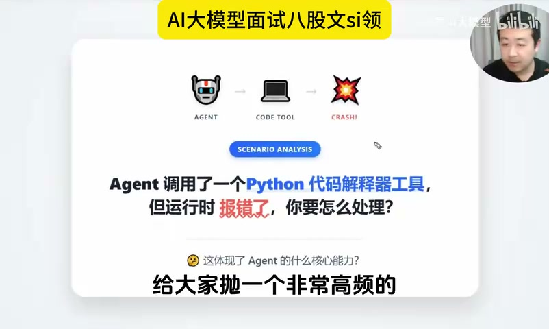
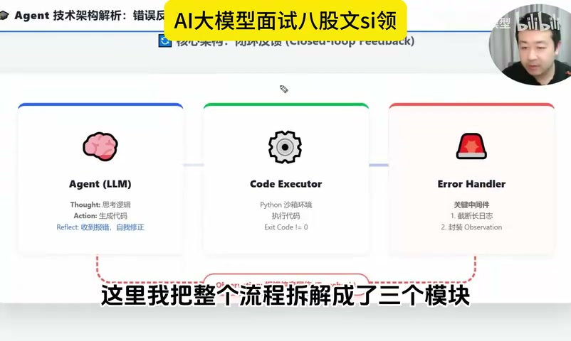
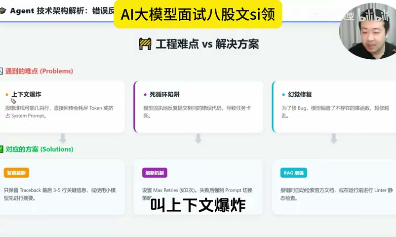
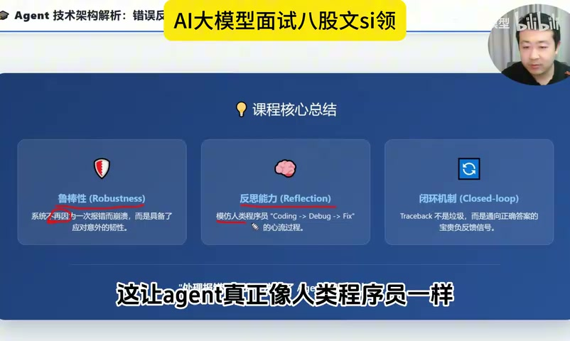

# 面试官：Agent 调用了 Python 代码解释器工具但运行时报错了，你要怎么处理

来源: https://www.bilibili.com/video/BV1sXXKBdEWz  
作者: 图灵AI大模型  
发布时间: 2026-03-28  
时长: 4:21  
处理方式: 下载视频后使用本地 `faster-whisper` 转写，并结合关键帧整理。原始转写见 `raw/transcript.txt`。



## 一句话概括

这期视频讲的是 Agent 调用 Python 代码解释器失败时的正确工程处理方式：不要把 traceback 原样丢给用户，也不要直接杀掉任务，而是把错误封装成 observation 反馈给 Agent，让 Agent 进入 `Coding -> Debug -> Fix` 的反思闭环。同时要处理三个工程风险：上下文爆炸、死循环和修复幻觉。

## 面试高分回答框架

```text
我不会直接把 Python 报错返回给用户，也不会简单重跑。

我会把代码执行链路拆成三层：
1. Agent 负责生成代码和反思修复。
2. Code Executor 在沙箱里执行代码，并返回 exit code、stdout、stderr 和 traceback。
3. Error Handler 负责截取、清洗、归类错误，把关键信息封装成 observation，再反馈给 Agent。

如果 exit code != 0，就触发闭环：
执行失败 -> 提取关键 traceback -> 形成 observation -> Agent 反思 -> 生成修复代码 -> 再次执行。

但这个闭环必须有工程边界：
- traceback 不能全塞进上下文，只保留最后 3-5 行关键错误，必要时用小模型总结。
- 设置 max retries，防止无限修复、无限执行。
- 对可能的幻觉修复，用官方文档/RAG、linter、单元测试或静态检查约束。
- 超过重试次数或风险过高时，降级为澄清、人工介入或明确失败原因。
```

## 1. 这个问题考察的不是 Python，而是 Agent 错误闭环

视频开头提出的场景是：Agent 写了一段 Python 代码，交给代码解释器执行，结果运行时报错。

错误处理有两种常见但错误的做法：

- 把红色报错信息直接展示给用户，说“我挂了”。
- 把任务杀掉，然后从头再跑一遍。

视频强调，这两种都不是工程化 Agent 的处理方式。人类程序员遇到报错时，会看 traceback，分析哪一行出错，再修改代码。Agent 也应该具备类似能力：把执行失败当作反馈信号，而不是终止信号。

## 2. 推荐架构：Agent、Code Executor、Error Handler 三层拆分



视频把流程拆成三个模块：

| 模块 | 责任 | 输入/输出 |
| --- | --- | --- |
| Agent / LLM | 思考、生成代码、根据反馈修复代码 | 输入任务和 observation，输出代码或修复方案 |
| Code Executor | 在沙箱环境执行 Python 代码 | 输出 stdout、stderr、exit code、traceback |
| Error Handler | 捕获错误、截断日志、封装 observation | 把可用错误信号反馈给 Agent |

关键点是：`Error Handler` 不是简单日志模块，而是闭环反馈模块。

当 `exit code != 0` 时，不应该丢弃报错，也不应该直接把完整 traceback 给用户，而是要把错误转成 Agent 可理解的 observation：

```text
代码执行失败。
错误类型: ZeroDivisionError
错误位置: line 5
关键原因: division by zero
请检查分母是否可能为 0，并重新生成修复后的代码。
```

这样 Agent 收到 observation 后，可以进入反思机制：

```text
执行失败 -> Error Handler 提取错误 -> Observation 反馈给 Agent
-> Agent 反思 -> 修改代码 -> 再次执行
```

## 3. Traceback 不是垃圾，而是反馈信号

视频里最核心的一句话是：在 Agent 世界里，报错不是垃圾，而是通向正确答案的反馈信号。

传统脚本遇到异常可能直接失败；Agent 系统要把异常转成可恢复路径。尤其是代码解释器工具，天然适合做闭环：

- 代码是 Agent 生成的，所以 Agent 可以改。
- 执行器能返回确定性错误，所以错误可以被解析。
- 修复后可以再次运行，所以结果可以被验证。

这就是 Agent 区别于普通脚本的地方：它不是一次性生成答案，而是在工具反馈中迭代接近正确结果。

## 4. 工程落地的三个坑



### 4.1 上下文爆炸

Python traceback 有时会非常长，尤其是深层库调用、框架异常、依赖错误，可能有几十行甚至几百行。

如果把完整 traceback 全塞给模型，会带来两个问题：

- Token 成本暴涨。
- 错误日志挤占 system prompt、任务目标和关键上下文，导致 Agent “失忆”。

处理方式：

- 只保留最后 3-5 行关键错误。
- 保留异常类型、出错文件、行号、错误信息。
- 对超长 traceback 先用小模型总结。
- 去掉无关栈帧、重复路径、环境噪声和框架模板日志。

### 4.2 死循环陷阱

如果 Agent 修复一次失败后继续修，可能进入：

```text
写错 -> 报错 -> 修改 -> 还是错 -> 再修改 -> 还是错
```

这会浪费 token、浪费工具调用成本，并让任务永远结束不了。

处理方式：

- 设置 `max_retries`，例如最多修复 3 次。
- 每次失败都记录错误类型和修复 diff。
- 如果连续两次错误相同，要求 Agent 换思路。
- 超过次数后停止闭环，返回明确失败原因或转人工。

### 4.3 幻觉修复

模型为了修 bug，可能编造不存在的函数、库参数或 API 用法。结果不是修复问题，而是引入新的错误。

处理方式：

- 运行前先做 linter 或静态检查。
- 对库函数、API、参数用法接入官方文档 RAG。
- 对关键逻辑生成最小单元测试。
- 对未知库函数做环境探测，例如 `import` 检查、`help()`、`dir()` 或版本查询。

## 5. 一个更完整的处理流程

可以把这个视频的思路整理成下面的工程流程：

```text
1. Agent 生成 Python 代码。
2. Code Executor 在沙箱执行。
3. 捕获 stdout、stderr、exit code、traceback、执行耗时。
4. 如果 exit code == 0:
   - 返回结果。
   - 必要时让 Agent 解释结果。
5. 如果 exit code != 0:
   - Error Handler 解析错误类型、行号、关键 traceback。
   - 截断或总结长 traceback。
   - 封装成 observation。
   - 反馈给 Agent 反思修复。
6. Agent 生成修复代码。
7. 再次执行。
8. 达到 max retries 或风险阈值后停止，进入降级路径。
```

## 6. 可直接复用的 Observation 模板

```json
{
  "tool": "python_interpreter",
  "status": "failed",
  "exit_code": 1,
  "error_type": "ZeroDivisionError",
  "error_message": "division by zero",
  "traceback_excerpt": [
    "File \"main.py\", line 5, in calculate",
    "return total / count",
    "ZeroDivisionError: division by zero"
  ],
  "retry_count": 1,
  "max_retries": 3,
  "instruction_to_agent": "请根据错误类型和出错行号修复代码，不要改动无关逻辑。"
}
```

这个 observation 比完整 traceback 更适合进上下文，因为它有结构、有边界、可测试，也方便做日志分析。

## 7. 可以沉淀到 Agent 工程规范里的规则

| 问题 | 工程规则 |
| --- | --- |
| 工具运行失败 | 工具必须返回结构化错误，而不是只返回自然语言 |
| traceback 太长 | Error Handler 负责截断、摘要、去噪 |
| Agent 重复失败 | 设置 `max_retries` 和熔断策略 |
| 修复方向跑偏 | 要求 Agent 基于 observation 修改，不允许无关重写 |
| 编造库函数 | 用官方文档 RAG、linter、静态检查和单元测试约束 |
| 用户体验差 | 不直接暴露原始堆栈，给用户返回可理解的失败原因和下一步 |

## 8. 课程核心总结



视频最后把价值总结成三个词：

- 鲁棒性：系统不再是一报错就崩，而是能扛住异常。
- 反思能力：Agent 像程序员一样经历 `Coding -> Debug -> Fix`。
- 闭环机制：traceback 不是垃圾，而是面向正确答案的反馈信号。

这类机制的本质，不是让模型“更聪明”，而是给模型补上工程闭环。模型负责生成和修复候选代码，执行器负责给出确定性反馈，错误处理器负责把反馈变成可用 observation。三者合起来，才是可落地的 Agent 工具调用系统。

## 我的提炼

这期视频可以归入 Agent 工程里的“工具错误恢复”和“反思闭环”部分。真正可复用的不是“遇到报错再试一次”，而是下面这个原则：

```text
工具错误必须结构化、可截断、可反馈、可重试、可熔断、可验证。
```

如果只做重试，Agent 会变成随机撞运气；如果只把错误丢给模型，Agent 会被长 traceback 淹没；如果没有熔断，Agent 会陷入无限循环。正确做法是把错误处理做成一条受控链路：捕获、摘要、反馈、反思、修复、验证、熔断。

