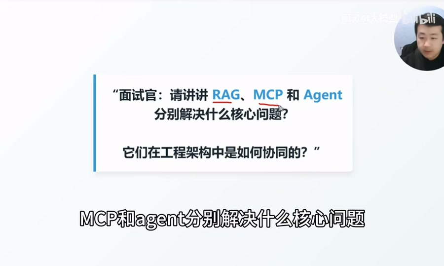
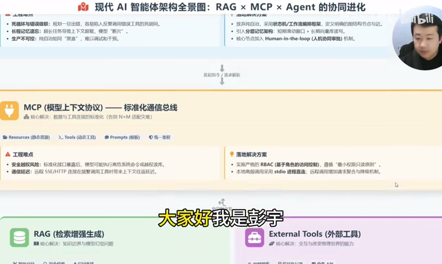
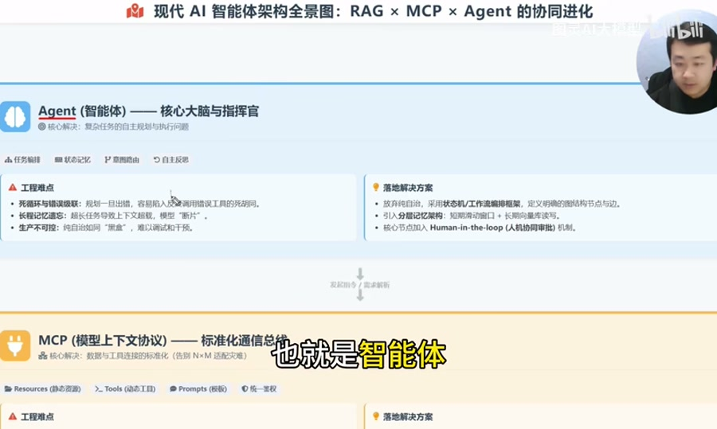
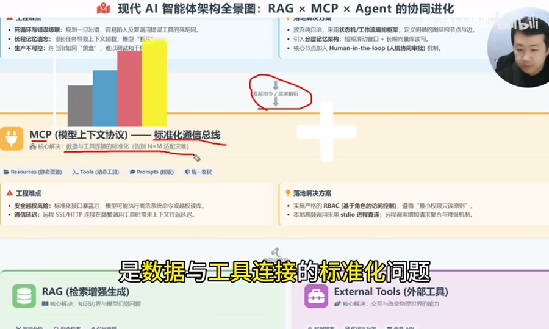
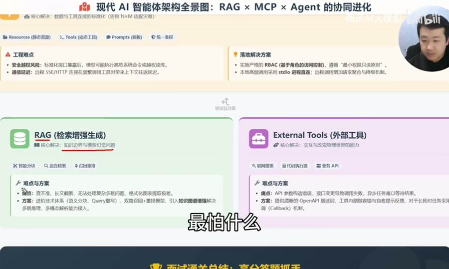
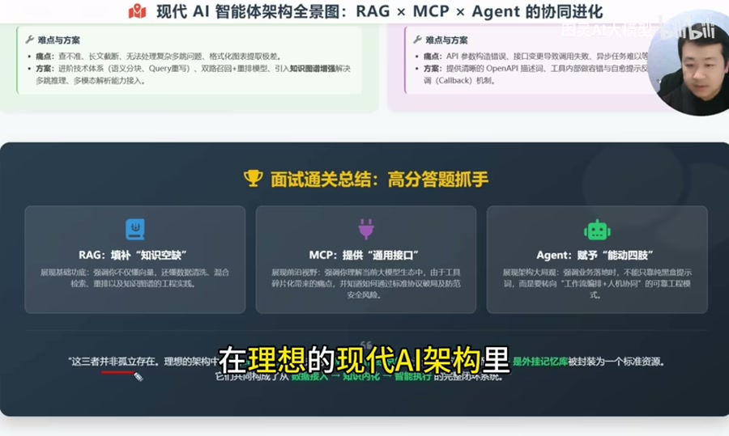

# RAG、MCP、Agent 和 Skill 分别解决什么问题

来源: https://www.bilibili.com/video/BV1TUXKBbEV1  
作者: 图灵AI大模型  
发布时间: 2026-03-27  
时长: 4:41  
处理方式: 下载视频后使用本地 `faster-whisper` 转写，并结合关键帧整理。原始转写见 `raw/transcript.txt`。



## 一句话概括

RAG、MCP、Agent 和 Skill 不是同一层的概念。它们分别解决知识、连接、执行和能力复用的问题：

- RAG 解决“模型不知道、不可靠”的知识增强问题。
- MCP 解决“模型如何标准化连接外部资源和工具”的协议问题。
- Agent 解决“模型如何围绕目标规划、调度和执行”的任务问题。
- Skill 解决“如何把可复用经验、流程、工具用法沉淀成可加载能力”的工程复用问题。

可以用一句话串起来：

```text
Agent 负责判断要做什么，Skill 提供可复用的做事方法，MCP 提供标准化外部连接，RAG 提供可靠知识依据。
```



## 原理部分：核心术语与应用方法

### 1. Agent：任务规划与执行层

Agent 的核心问题是：让大模型不只是回答问题，而是能围绕一个目标持续推进任务。

视频把 Agent 类比为整个架构里的“大脑和指挥官”。它负责任务拆解、意图路由、工具选择、状态维护和结果反思。



Agent 典型能力：

- 任务编排：把复杂目标拆成多个步骤。
- 意图路由：判断用户到底需要问答、检索、写代码、查数据还是执行动作。
- 工具选择：决定调用 RAG、数据库、搜索、代码解释器、业务 API 等能力。
- 状态跟踪：记录任务进行到哪一步，哪些信息已经确认。
- 反思修正：根据工具返回结果判断是否继续、重试或调整方案。

工程上不能把 Agent 理解成“完全自由行动的大模型”。生产环境里的 Agent 常见问题是死循环、长任务失忆、黑盒不可控和误调用工具。更稳的做法是把 Agent 放进可控流程里：

- 用状态机或工作流约束任务路径。
- 给每个步骤定义输入、输出、失败分支和退出条件。
- 用短期上下文、长期记忆、结构化任务状态分层管理信息。
- 在审批、发布、删除、转账、写库等高风险节点加入 `Human-in-the-loop`。

面试表达：

```text
Agent 解决的是复杂任务的规划与执行问题。它是调度器和执行大脑，但工程上不能完全放任自治，通常要用状态机或工作流约束路径，用分层记忆维护任务状态，并在高风险节点加入人工确认。
```

### 2. Skill：可复用能力封装层

Skill 可以理解为给 Agent 使用的“专项能力包”。它通常沉淀的是某类任务的操作方法、判断标准、工具调用流程、模板、脚本和注意事项。

它解决的核心问题是：同一类任务不要每次都从零提示、从零摸索，而是把稳定有效的做法固化下来，让 Agent 在合适场景自动加载和复用。

Skill 通常包含：

- 触发条件：什么时候应该使用这个能力。
- 操作流程：完成任务的步骤、检查点和失败处理。
- 领域知识：某类任务里的概念、约束、最佳实践。
- 工具说明：需要调用哪些脚本、命令、API 或 MCP 工具。
- 输出规范：最终应该生成什么格式的结果。

Skill 和其他概念的边界：

| 对比 | 区别 |
| --- | --- |
| Skill vs Agent | Agent 是执行和调度主体，Skill 是 Agent 可加载的专项方法 |
| Skill vs MCP | Skill 描述“怎么做”，MCP 提供“能连接什么、能调用什么” |
| Skill vs RAG | Skill 偏流程和方法复用，RAG 偏事实知识检索 |
| Skill vs Prompt | Prompt 往往是一次性指令，Skill 是可长期维护、可复用的能力模块 |

举例：

- “分析 B 站视频并生成专题文档”可以做成一个 Skill。
- “转写音频、抽帧、整理报告”是 Skill 里的流程。
- “调用本地转写脚本、读取视频帧、保存 Markdown”是 Skill 可能使用的工具。
- “视频里的具体知识点”可以进入 RAG 或文档库。

面试表达：

```text
Skill 解决的是能力复用和流程沉淀问题。它不是一个外部工具协议，也不是知识库，而是把某类任务的经验、步骤、工具用法和输出规范打包成 Agent 可加载的能力模块。这样 Agent 遇到同类任务时，不需要重新摸索，而是按经过验证的流程执行。
```

### 3. MCP：标准化连接层

MCP 的核心问题是：让模型或 Agent 用统一方式连接外部资源、工具和提示模板。

视频把 MCP 类比为 AI 世界里的“统一 Type-C 接口”。没有 MCP 时，每个模型和每个工具之间都可能要写定制适配，最后变成 `N x M` 的连接复杂度。MCP 的价值是把外部能力抽象成统一协议。



MCP 常见抽象：

- `Resources`: 资源，例如文件、数据库记录、文档、知识材料。
- `Tools`: 工具，例如搜索、代码执行、数据库查询、业务 API。
- `Prompts`: 提示模板，例如固定任务模板、查询模板、生成模板。

MCP 的应用方法：

- 把企业内部系统包装成 MCP Server。
- 把数据库查询、文件读取、搜索、工单系统等能力暴露为 Tool。
- 把可读取的业务文档、配置、知识材料暴露为 Resource。
- 让 Agent 通过统一协议发现能力、读取资源、调用工具。

工程上要注意：统一接口会放大权限和安全问题。MCP 上线时必须配套鉴权、授权、审计、最小权限、超时、重试和降级。

面试表达：

```text
MCP 解决的是模型和外部工具、数据、提示模板之间的标准化连接问题。它把原本分散的 API 适配收敛成统一协议，让 Agent 能按标准方式发现资源和调用工具。但工程落地必须配套 RBAC、最小权限、审计、超时重试和降级，否则统一接口会放大安全风险。
```

### 4. RAG：知识增强层

RAG 的核心问题是：模型参数里没有企业私有知识、实时知识或专业知识时，如何让回答有依据。

视频里的类比是“给模型一本参考书，让它开卷考试”。RAG 不改变模型本身，而是在生成前先检索相关材料，再把证据放入上下文，让模型基于证据回答。



RAG 解决的问题：

- 模型不知道企业内部数据。
- 模型不知道最新事实。
- 模型容易幻觉，需要证据约束。
- 知识频繁更新，不适合每次重新训练模型。

RAG 常用工程方法：

- 文档解析：把 PDF、网页、Markdown、数据库记录等转成可检索文本。
- 语义分块：按语义切 chunk，而不是机械按长度切。
- Query 改写：把用户问题改写成更适合检索的查询。
- 混合检索：结合 BM25 关键词检索和向量语义检索。
- Rerank：对召回结果重新排序，提高进入上下文的证据质量。
- 上下文压缩：去重、摘要、裁剪，把最关键证据放进模型上下文。
- 引文和证据链：让回答带来源，便于审计和验证。
- 知识图谱增强：处理多跳推理、实体关系和复杂关联查询。

RAG 常见问题：

- 召回不准：检索出来的内容与问题不相关。
- 召回不全：关键证据没有被取出来。
- 长文截断：材料太长，进入上下文后被截断或被模型忽略。
- 证据冲突：多个来源之间说法不一致。
- 生成失控：检索到了正确材料，但模型仍然自由发挥。

面试表达：

```text
RAG 解决的是知识边界和幻觉问题。它先从知识库检索相关证据，再把证据放入上下文生成回答。工程上不能只做向量库，要重点处理分块、Query 改写、混合检索、Rerank、上下文压缩、证据引用和多跳推理。
```

### 5. External Tools：动作执行层

视频在 RAG 旁边还提到外部工具，例如搜索、代码执行器和业务 API。它们和 RAG 的区别是：

- RAG 偏“查知识、补上下文”。
- Tool 偏“做动作、改状态、产生结果”。

例如：

- 查公司知识库是 RAG。
- 运行代码、创建工单、发邮件、改数据库是工具调用。

工具调用的工程风险主要是参数错误、权限越界、状态变更不可逆和长任务无反馈。对应方案是清晰的工具描述、参数校验、幂等设计、写操作确认、审计日志、回调机制和失败重试。

## 实践部分：如何进行工程化协作

### 1. 推荐架构关系

这几个部分在工程里不是并列摆放，而是分层协作：

```text
用户目标
  ↓
Agent：理解目标、拆解任务、选择路径
  ↓
Skill：加载专项流程、模板、检查清单和工具使用方法
  ↓
MCP：发现和调用标准化资源与工具
  ↓
RAG / Tools / Business APIs：提供知识、执行动作、返回结果
  ↓
Agent：整合结果、继续推理、给出最终输出或进入人工确认
```

更具体地说：

- Agent 是调度中心。
- Skill 是任务方法库。
- MCP 是连接协议和能力总线。
- RAG 是知识服务。
- Tool 是动作服务。



### 2. 一次典型任务如何流转

假设用户说：“帮我分析一个客户投诉，并判断是否需要升级到人工客服。”

工程化流转可以是：

1. Agent 识别任务类型：这是客户支持分析任务。
2. Agent 加载对应 Skill：读取投诉处理流程、升级规则、输出模板。
3. Skill 指导 Agent 先补齐上下文：需要客户历史订单、聊天记录、产品政策。
4. Agent 通过 MCP 调用资源：读取 CRM、订单系统、知识库。
5. RAG 检索政策和历史案例：返回相关规则、赔付标准、类似案例。
6. Agent 综合判断：给出投诉原因、风险等级、建议动作。
7. 如果涉及退款、封号、赔付等动作，进入人工确认。
8. 审批通过后，Agent 通过 MCP 调用业务工具执行动作。
9. 系统记录完整 trace：输入、检索证据、工具调用、审批结果和最终输出。

这条链路里，每个模块职责不同：

| 阶段 | 谁负责 | 产出 |
| --- | --- | --- |
| 理解目标 | Agent | 任务意图、执行计划 |
| 选择方法 | Skill | 流程、模板、检查项 |
| 接入能力 | MCP | 可用资源和工具 |
| 补充事实 | RAG | 证据、上下文、引用 |
| 执行动作 | Tools | 查询结果、写操作结果、任务状态 |
| 风险控制 | 工作流 + 人审 | 审批、拦截、审计 |

### 3. 常见协作模式

#### 模式一：知识问答型

适合企业知识库、政策问答、技术文档问答。

```text
Agent 判断用户在问知识
  -> Skill 提供问答格式和证据要求
  -> MCP 调用 RAG 服务或知识库资源
  -> RAG 返回证据
  -> Agent 基于证据回答并附来源
```

重点是检索质量、证据引用和空结果策略。没有检索到证据时，不要硬答，要明确说明缺少依据。

#### 模式二：工具执行型

适合查数据库、跑脚本、生成报告、调用业务系统。

```text
Agent 拆解任务
  -> Skill 给出执行步骤和参数要求
  -> MCP 暴露可调用工具
  -> Agent 调用 Tool
  -> Tool 返回结构化结果
  -> Agent 整理结果或继续下一步
```

重点是工具描述、参数校验、错误处理、幂等和审计。

#### 模式三：长流程自动化型

适合数据分析、代码修复、运营任务、审核流、工单流转。

```text
Agent 制定计划
  -> Skill 约束流程和检查点
  -> MCP 连接多个系统
  -> RAG 补充领域知识
  -> Tools 执行具体动作
  -> 工作流记录状态
  -> 高风险节点人工确认
```

重点是状态机、任务记忆、失败恢复和人工接管。

### 4. 工程落地清单

Agent 侧：

- 是否有明确任务边界和退出条件。
- 是否有状态机或工作流约束。
- 是否记录中间步骤和工具调用 trace。
- 是否避免无限循环和重复调用。
- 是否有人工接管入口。

Skill 侧：

- 是否有清晰触发条件。
- 是否沉淀了稳定流程，而不是只写概念说明。
- 是否说明需要哪些工具、输入和输出。
- 是否包含失败处理、检查清单和质量标准。
- 是否能被版本化、评审和持续维护。

MCP 侧：

- 是否统一鉴权和授权。
- 是否按角色控制资源和工具权限。
- 是否遵守最小权限原则。
- 是否区分只读工具和写操作工具。
- 是否有超时、重试、降级和审计。

RAG 侧：

- 是否有合理的文档解析和分块策略。
- 是否支持 Query 改写、混合检索和 Rerank。
- 是否能处理空召回、弱召回和证据冲突。
- 是否输出引用来源。
- 是否能观测召回质量和生成质量。

工具侧：

- 是否有清晰的 schema 和参数说明。
- 是否做参数校验和错误反馈。
- 写操作是否幂等、可回滚、可审计。
- 长任务是否有进度、回调或轮询机制。
- 高风险动作是否需要确认。

### 5. 面试回答模板

```text
我会把 RAG、MCP、Agent 和 Skill 看成现代 AI 应用里的四类能力。

RAG 解决知识边界和幻觉问题，负责把企业知识、实时信息和证据检索出来，放进上下文辅助生成。

MCP 解决连接标准化问题，负责把文件、数据库、业务 API、搜索、代码执行器等资源和工具用统一协议暴露给模型或 Agent。

Agent 解决复杂任务的规划和执行问题，负责理解目标、拆解步骤、选择工具、维护状态和整合结果。

Skill 解决能力复用问题，负责把某类任务的流程、模板、工具用法、检查清单和最佳实践沉淀成可加载模块，让 Agent 遇到同类任务时按标准流程执行。

工程协作时，Agent 是调度中心，先根据用户目标选择合适 Skill；Skill 给出做事流程和质量标准；Agent 再通过 MCP 调用 RAG 或外部工具；RAG 提供知识证据，Tool 负责执行动作；最后 Agent 汇总结果，并在高风险节点进入人工审批。这样就形成了从知识检索、能力连接、流程复用到任务执行的闭环。
```

## 结论

这几个概念可以按“问题域”来记：

| 概念 | 解决的问题 | 工程关键词 |
| --- | --- | --- |
| RAG | 知识不足、幻觉、证据缺失 | 分块、检索、Rerank、引用、上下文压缩 |
| MCP | 外部资源和工具连接混乱 | 协议、Resource、Tool、Prompt、权限、审计 |
| Agent | 复杂任务无人调度 | 规划、路由、状态、反思、工作流、人审 |
| Skill | 经验无法复用 | 流程、模板、检查清单、脚本、质量标准 |

真正落地时，不要只讲名词。更有工程含量的表达是：

```text
用 Skill 固化方法，用 Agent 编排任务，用 MCP 连接能力，用 RAG 提供证据，用工作流、权限、审计和人审控制风险。
```
