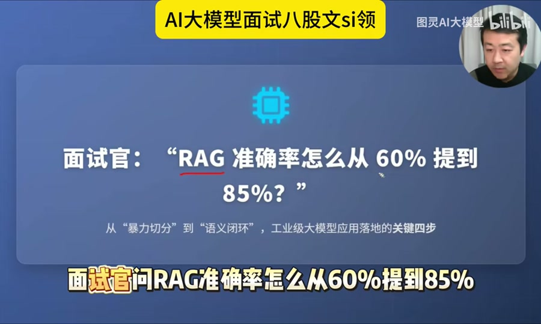
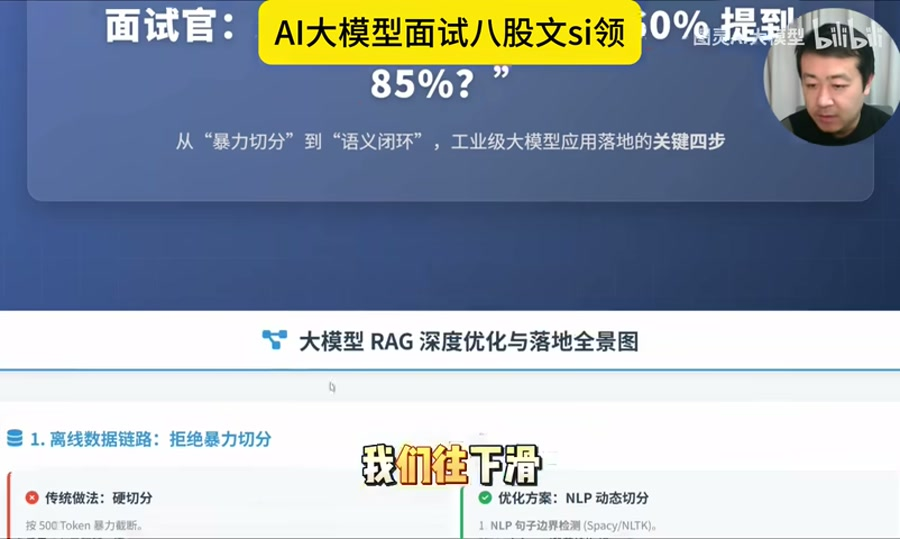
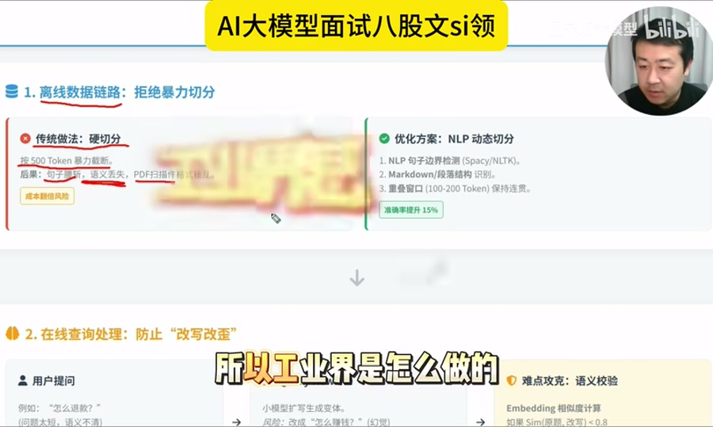
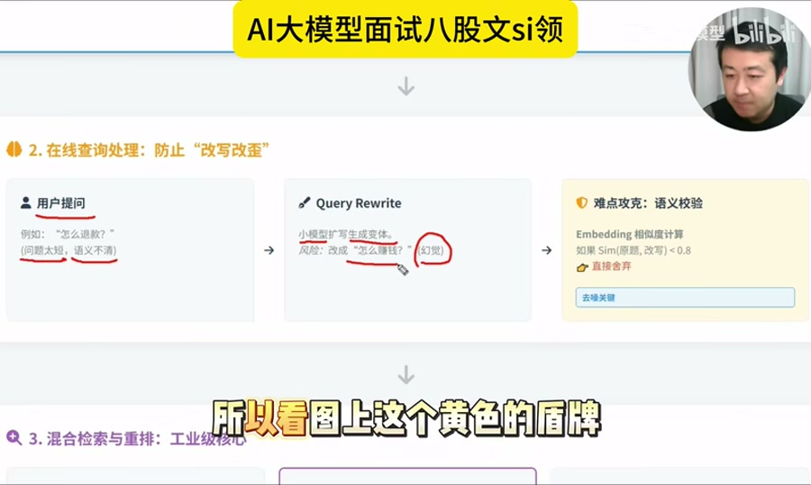
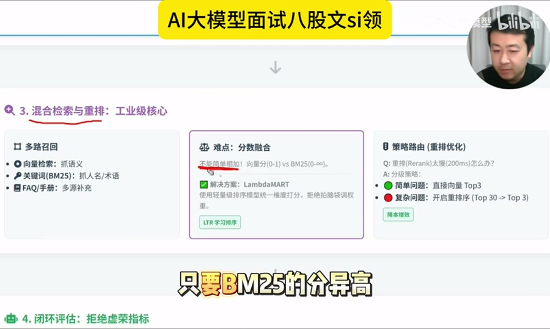
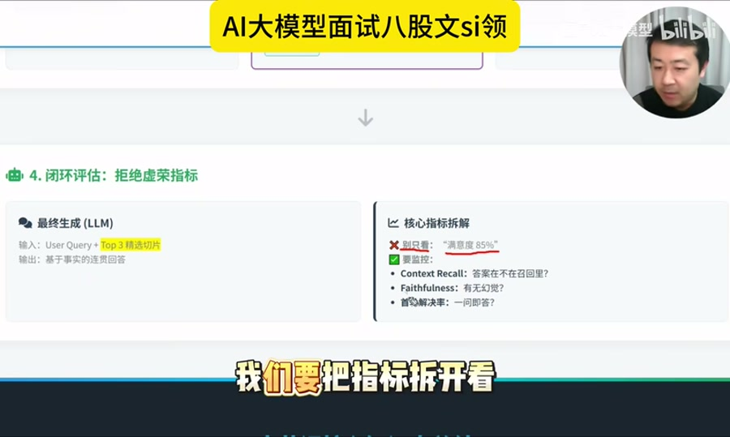
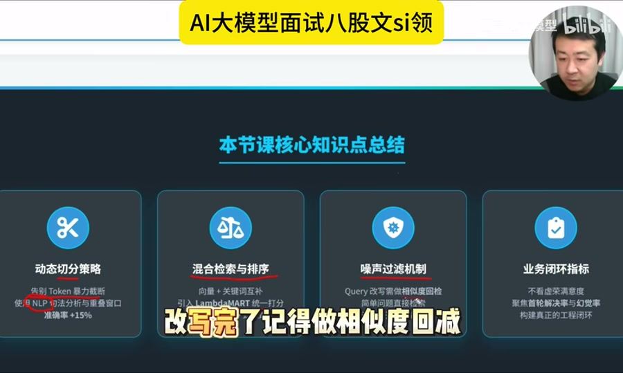

# 面试官问：RAG 准确率怎么从 60% 提到 85%

来源: https://www.bilibili.com/video/BV1ktAgzRE83  
作者: 图灵AI大模型  
发布时间: 2026-03-22  
时长: 4:41  
处理方式: 下载视频后使用本地 `faster-whisper` 转写，并结合关键帧整理。原始转写见 `raw/transcript.txt`。



## 一句话概括

这期视频讲的是 RAG 从 demo 走向工业级落地的优化路径：不要先换大模型，而是先拆解 RAG 链路，把“数据切分、查询改写、混合检索、重排序、指标闭环”逐层优化。核心思想是：准确率低不是一个问题，而是多个环节叠加出的结果，必须先定位瓶颈，再对症优化。

## 面试高分回答框架

```text
我不会直接说换更大的模型，而会先把 RAG 链路拆开诊断。

第一层看数据切分，避免按固定 token 暴力切断语义，用 NLP 动态切分、Markdown 结构识别和 100-200 token overlap 保持上下文连续。

第二层看查询处理，对短 query 做改写和扩展，但改写后要用 embedding 相似度回检，防止 query drift。

第三层看召回和排序，不能只靠向量检索，也不能把向量分和 BM25 分直接相加。应使用混合检索，再用 LambdaMART 或 reranker 统一排序。

第四层看评估闭环，不只看满意度，要拆成 Context Recall、Faithfulness、首轮解决率等指标，判断问题到底出在检索还是生成。
```

## 1. 先定位：60% 准确率为什么上不去

视频开头强调，很多 RAG 系统一开始 demo 跑得不错，但真实上线后准确率只有 60% 左右。原因通常不是“大模型不够聪明”，而是 RAG 链路里多个细节没有工程化。



典型问题包括：

- 文档被暴力切分，关键句、表格、标题和上下文关系被切断。
- 用户 query 太短，例如“怎么退款”，语义不清晰。
- Query 改写后跑偏，引入新噪声。
- 向量检索和关键词检索分数尺度不同，直接相加会失真。
- Rerank 效果好但成本高，高并发下延迟不可控。
- 只看整体满意度，不知道到底是召回错了，还是生成幻觉了。

## 2. 第一层优化：动态切分，拒绝暴力切分



传统做法是每 500 个 token 固定切一刀。这种方式简单，但容易把完整语义切断：

- 关键句被腰斩。
- 表格被切碎。
- 标题和正文分离。
- 前后文关系丢失。
- PDF 扫描件和复杂格式文档更容易损坏语义。

工业级做法：

- 用 NLP 模型识别句子边界。
- 识别 Markdown 标题、段落、列表和表格结构。
- 对相邻 chunk 保留 100-200 token 的重叠窗口。
- 按业务文档结构而不是固定长度决定切分边界。

这一步的价值是提升召回质量。视频里的说法是：不用改模型，只修切分策略，准确率就能明显提升，属于性价比最高的优化。

## 3. 第二层优化：Query 改写要防止“改写改歪”

用户真实提问经常很短，例如：

```text
怎么退款？
```

这类 query 信息量不足，直接检索很容易召回不准。因此常见做法是用小模型做 query rewrite，扩写成更完整的问题，或者生成多个变体再检索。

但 query rewrite 有风险：模型可能把“怎么退款”改成“怎么赚钱”，语义方向完全跑偏。



工程方案：

- 对原 query 生成若干改写版本。
- 用 embedding 计算原 query 与改写 query 的相似度。
- 如果相似度低于阈值，例如 0.8，说明改写跑偏，直接丢弃。
- 只把通过语义校验的 query 送入检索。

这一步解决的是“改写引入噪声”的问题。Query 改写不是越多越好，必须有回检机制。

## 4. 第三层优化：混合检索不要直接加分

RAG 召回通常会同时用：

- 向量检索：擅长语义相似。
- BM25/关键词检索：擅长精确词匹配、人名、术语、编号、FAQ 关键词。

问题在于二者分数尺度不同：

- 向量相似度通常在 0-1。
- BM25 分数可能是 10、20，甚至更高。

如果直接 `score = vector_score + bm25_score`，BM25 分数会淹没向量分数，混合检索实际失效。



视频给出的工业级方案是使用排序模型，例如 LambdaMART：

- 把向量分、BM25 分、标题匹配、段落位置、文档类型、点击反馈等特征统一输入排序模型。
- 由模型学习如何组合这些特征。
- 避免人工拍脑袋设置权重。

这类方法本质上是 Learning to Rank，适合把多路召回结果融合成统一排序。

## 5. 第四层优化：Rerank 要做策略路由

Rerank 模型效果通常更好，但成本和延迟也更高。视频里提到一个典型问题：如果一次 rerank 要 200ms，并发到 100，系统可能扛不住。

因此不应该所有问题都走重排序，而要做策略路由：

- 简单问题：直接向量检索 Top3，快速响应。
- 复杂问题：先召回 Top30，再启用 rerank 选 Top3。
- 高价值或高风险问题：允许更高延迟，换取更高准确率。

这一步的核心是：把好钢用在刀刃上。准确率、延迟和成本要一起优化。

## 6. 第五层优化：指标要拆开看

视频最后强调，不能只说“满意度 85%”。用户点不满意时，你必须知道问题出在哪里：

- 是答案根本不在检索结果里？
- 还是资料里有答案，但模型生成时胡编了？
- 是召回问题？
- 是排序问题？
- 是生成问题？



建议拆分指标：

| 指标 | 看什么 | 如果不好，说明什么 |
| --- | --- | --- |
| Context Recall | 正确答案是否出现在检索回来的 chunk 中 | 检索链路有问题，可能是切分、query、召回或排序失败 |
| Faithfulness | 最终回答是否忠实于检索材料 | 生成链路有问题，模型可能在幻觉或过度发挥 |
| 首轮解决率 | 用户一次提问是否被解决 | 真实业务体验不好，可能需要补召回、追问或流程设计 |
| 用户满意度 | 用户主观反馈 | 只能作为最终体验指标，不能定位具体瓶颈 |

## 7. 四步落地清单



视频总结的四个核心动作：

1. 动态切分策略  
   不要暴力 token 截断，用 NLP 边界识别、文档结构解析和重叠窗口保持语义连续。

2. 混合检索与排序  
   不要简单相加分数，用向量 + BM25 多路召回，再用 LambdaMART/reranker 做统一排序。

3. 噪声过滤机制  
   Query 改写后要做 embedding 相似度回检，避免改写模型把问题带偏。

4. 业务闭环指标  
   不要只看满意度，要拆 Context Recall、Faithfulness、首轮解决率，定位下一步优化方向。

## 工程检查表

可以用下面这张表检查自己的 RAG 项目：

| 检查项 | 问题 | 建议 |
| --- | --- | --- |
| 文档切分 | 是否按固定 token 暴力切分？ | 改成语义/结构切分，加 overlap |
| 文档格式 | 表格、标题、列表是否被破坏？ | 针对 Markdown、PDF、HTML 分别解析 |
| Query 改写 | 改写是否可能跑偏？ | 做原 query 与改写 query 的 embedding 相似度校验 |
| 召回策略 | 是否只用向量检索？ | 加 BM25/关键词/FAQ 多路召回 |
| 分数融合 | 是否把不同尺度分数直接相加？ | 用 LambdaMART 或 Learning-to-Rank 方法统一排序 |
| Rerank 成本 | 是否所有请求都重排？ | 简单请求快速路径，复杂请求启用 rerank |
| 指标体系 | 是否只看满意度？ | 拆成 Context Recall、Faithfulness、首轮解决率 |
| 失败分析 | 是否知道失败出在哪一层？ | 记录 query、召回 chunk、rerank 分数、最终回答和用户反馈 |

## 最适合复用的面试表达

```text
RAG 准确率从 60% 到 85%，不是靠单点换模型，而是靠链路级优化。

我会先从离线数据开始，避免固定 token 暴力切分，改成 NLP 动态切分、结构识别和 overlap，保证语义不被切碎。

然后优化在线 query，对短 query 做 rewrite，但要用 embedding 相似度校验防止改写跑偏。

召回阶段使用向量检索 + BM25 的混合检索，但不直接相加分数，而是用 LambdaMART 或 reranker 统一排序。

最后建立指标闭环，把满意度拆成 Context Recall、Faithfulness 和首轮解决率，判断问题到底在检索、排序还是生成。
```

## 结论

这期视频的核心不是“某个神奇技巧能把准确率拉到 85%”，而是建立一套 RAG 工业化思维：

- 先修数据，再修 query。
- 先保证召回，再优化排序。
- 先拆指标，再谈准确率。
- 先定位问题层级，再选择优化手段。

RAG 从玩具 demo 变成工业级产品，关键在于把每个环节都变成可观测、可评估、可迭代的工程系统。
