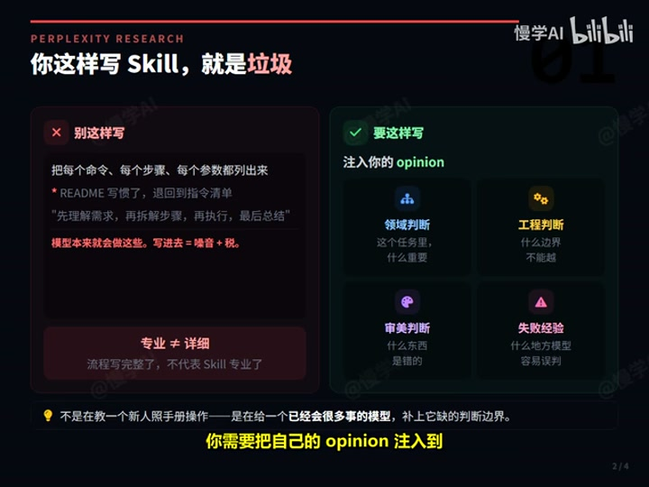
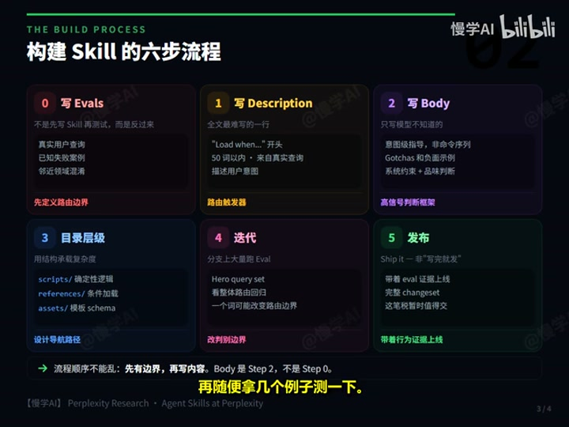
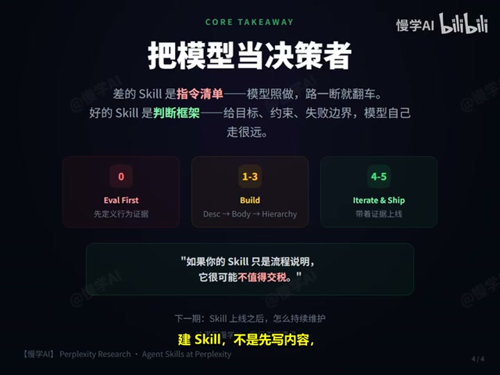

# Perplexity：你这样写 Skill，就是造垃圾

来源: https://www.bilibili.com/video/BV1rb5y6wEJV  
作者: 慢学AI  
发布时间: 2026-05-13  
时长: 9:13  
处理方式: 下载视频后使用本地 `faster-whisper` 转写，并结合关键帧核对结构。

## 一句话概括

这期视频的核心结论是：Skill 不是给新人看的操作手册，而是给已经有大量通用能力的模型补充“判断边界”。如果 Skill 只是把显而易见的流程、命令和步骤写进去，它不会增强模型，只会增加上下文税。

## 核心观点

好的 Skill 应该让模型做出不一样、且更正确的判断。它真正有价值的部分不是“先做什么、再做什么”的通用流程，而是人的领域判断、工程判断、审美判断和失败经验。

视频把这种高信号内容称为 `opinion`，包括：

- 这个任务里什么最重要。
- 什么做法是错的。
- 哪些边界不能越。
- 哪些地方模型自己容易误判。
- 哪些看起来合理的做法实际会导致失败。

## 为什么“详细”不等于“专业”

很多工程师写 Skill 时会沿用写说明文档的习惯，把命令、参数和步骤尽量列全。视频认为这正是低质量 Skill 的来源。

原因有三点：

- 大模型已经知道大量通用工具和标准流程，重复写这些内容增量很小。
- 这些内容会常驻上下文，导致每次任务都支付不必要的上下文税。
- 步骤写得越死，模型越容易被锁进固定轨道，一旦真实环境变化，Skill 反而让模型变笨。

例如，不要把 Git 操作写成固定命令序列：先 `git log`、再 `checkout main`、再建分支、再 `cherry-pick`。更好的表达是：把这个 commit cherry-pick 到干净分支；解决冲突时保留原意；如果不能干净合入，就解释原因。

这就是从“命令级指导”切到“意图级指导”。

## 构建 Skill 的六步流程

### 0. 先写 Evals

Perplexity 的顺序不是先写 Skill 再随便测几个例子，而是反过来：先写评测，再写 Skill。

评测用例主要来自三类：

- 真实用户查询。
- 已知失败案例。
- 临近领域混淆，也就是那些看起来相似、但不应该加载这个 Skill 的请求。

这里最重要的是负例。Skill 最大的风险之一不是“不加载”，而是“乱加载”。一旦误加载，它会把无关内容塞进上下文，影响其他 Skill，甚至把模型带到错误方向。

所以 Step 0 的本质是：先定义路由边界，再写 Skill 内容。

### 1. 写 Description

视频强调，整个 Skill 里最难写的可能就是 `description`，因为它是路由触发器。

一个好的 description 要解决两个问题：

- 该加载时能加载。
- 不该加载时不会误伤其他场景。

建议写法：

- 用 `Load when...` 这类触发语义开头。
- 控制在 50 词以内。
- 尽量使用真实用户查询里的意图表达。
- 每个词都服务于路由判断。

description 写太宽，会误触发；写太窄，会错过加载。对 Skill 来说，修改 description 不是文案优化，更像修改分类器的判别边界。

### 2. 写 Body

正文是 Step 2，不是第一步。前面必须先有评测和路由边界，最后才写主体内容。

正文不要写成完整操作手册，重点应该放在模型不知道的内容上：

- 目标是什么。
- 冲突时保留什么。
- 失败时怎么解释。
- 哪些事情不要做。
- 哪些坑点来自真实运行经验。
- 哪些 negative examples 能帮助模型避开错误路径。

标准流程模型大概率知道，失败边界模型不知道。因此正文最值钱的内容，不是“正常情况怎么走”，而是“哪些看起来可以做、但千万别做”。

### 3. 用目录层级承载复杂度

Skill 的目录结构不是文件整理，而是在设计模型的导航路径。

视频提到几类典型放置方式：

- `scripts/`: 放确定性逻辑，例如解析日志、检查文件格式、转换数据、生成固定结构、跑验证脚本。
- `references/`: 放重型知识，例如 API 错误码、行业规则、合规说明，并通过条件加载让模型需要时再读。
- `assets/`: 放模板和 schema，用来固定输出结构，减少生成漂移。
- `config.json`: 放首次运行时询问并保存的用户设置，例如默认频道、默认项目、默认仓库。

判断标准是：什么信息必须马上给模型，什么信息可以等需要时再读，什么信息根本不该让模型推理、而应该交给确定性脚本。

### 4. 迭代

Perplexity 建议在一个分支上做大量迭代，从主分支没有 Skill 的状态开始，先准备代表性请求集，再跑大量 Eval，最后提交包含评测集的完整变更。

原因是 Skill 不是普通文档。它一改，就可能影响路由、上下文、其他 Skill 和整体性能。评审不能只看 diff，还要看：

- 这个 Skill 解决了哪些请求。
- 新增了哪些负例。
- 有没有误加载。
- 有没有影响相邻 Skill。
- 有没有整体性能回归。

尤其要小心 description 里的小词改动，它可能改变路由边界，并 spill over 到其他 Skills。

### 5. 发布

原文里的发布很短，可以理解为 `Ship it`，但视频提醒这不是“写完就发”。发布的意思是：带着行为证据上线。

前面已经完成 Eval、description、正文压缩、目录拆分和分支迭代后，一个 Skill 才算初步证明：这笔上下文税暂时值得交。

## 可执行清单

写 Skill 前先问这些问题：

- 我有没有真实用户查询，而不是只靠想象场景？
- 我有没有写负例，防止 Skill 被误加载？
- description 是否能明确控制触发边界？
- body 里是否主要是判断、边界和坑点，而不是通用流程？
- 可确定执行的逻辑是否已经放进 `scripts/`？
- 重型知识是否通过 `references/` 条件加载？
- 输出模板或 schema 是否放进 `assets/`？
- 修改后有没有用 Eval 证明它没有破坏其他 Skill？

## 反面清单

以下内容不适合直接塞进 Skill 正文：

- “先理解需求，再拆解步骤，再执行，最后总结”这类通用流程。
- 模型已经知道的工具基础用法。
- 长篇命令序列。
- 一次性全部读取的大型参考资料。
- 没有负例支撑的宽泛触发条件。
- 只是为了看起来完整而写的说明。

## 最终 Takeaway

差的 Skill 是指令清单，好的 Skill 是判断框架。

建 Skill 不是先写内容，而是先定义行为证据：

- 用 Eval 定义它应该解决什么问题。
- 用 description 控制它什么时候进入上下文。
- 用 body 写高信号判断，而不是通用说明。
- 用目录层级承载重内容和条件内容。
- 用迭代和评测证明它没有破坏系统。
- 最后再发布。

如果一个 Skill 只是流程说明，它很可能不值得交税。只有当它能证明自己解决了真实问题、守住了路由边界，并把人的判断压缩进上下文时，这笔上下文税才有理由交。

视频最后也埋下了下一期主题：Skill 上线前只是第一关，上线后还会面临持续维护问题。一个刚发布时很干净的 Skill，经过几轮维护后可能变得越来越长、越来越脏，最终变成上下文债务。
